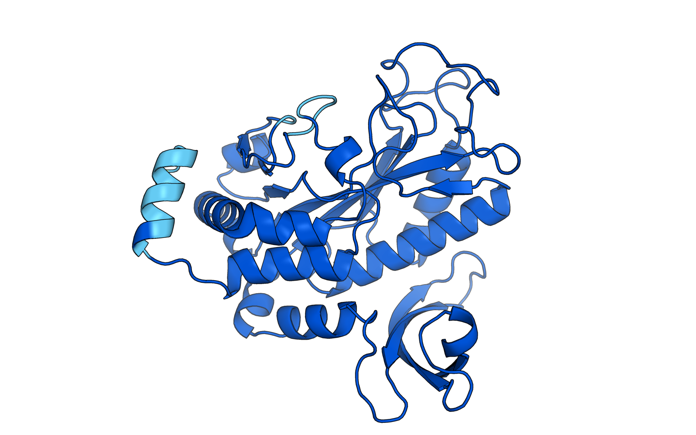

<p align="center">
  
  <br/>
  <sub><em>AlphaFold structure of the GS2 catalytic domain (residues 111–430; <a href="https://alphafold.ebi.ac.uk/entry/Q43127">UniProt Q43127</a>).</em></sub>
</p>

# Synthetix: GS2 Catalytic-Domain Variant Analysis Pipeline

[](https://www.python.org/downloads/release/python-3110/)
[](https://build.nvidia.com/arc/evo2-40b)
[](https://biopython.org/)
[](https://seaborn.pydata.org/)
[](https://matplotlib.org/)
[](https://vpython.org/)
[](#license)
[](#)

---

## Contents

- [Overview](#overview)
- [Setup](#setup)
- [Quick Start](#quick-start)
- [Usage](#usage)
- [Dataset](#dataset)
- [Visualization](#visualization)
- [References](#references)
- [Author](#author)

---

## Overview

Synthetix is a research pipeline that produces a ranked list of candidate single-nucleotide variants in the catalytic domain (residues 111–430) of chloroplastic **Glutamine Synthetase 2 (GS2)** from *Arabidopsis thaliana* (UniProt **Q43127**; TAIR locus AT5G35630) and couples that ranking with a structural-audit track for the top candidates.

GS2 catalyzes the ATP-dependent condensation of glutamate and ammonia into glutamine — the entry point for nitrogen assimilation in plant chloroplasts. The enzyme is densely constrained around its active site (metal binding, substrate anchoring, transition-state stabilization), so it's a demanding benchmark for sequence-level variant-effect methods. Applications motivating this work include nitrogen-use efficiency in terrestrial crops and, aspirationally, space-based agriculture (see § Motivation).

### How the ranking is produced

Synthetix uses **NVIDIA Evo 2 40B** — an autoregressive genomic foundation model — as the scoring backend. For each candidate SNP at DNA position *i*:

1. The script prompts Evo 2 with the *left-context only* (bases 0 through *i*−1) and requests one continuation token with `enable_logits=True`.
2. The returned logits row scores every possible next base. Synthetix reads the entries for the reference and alternate nucleotides directly.
3. Δ-LL is `logit(alt) − logit(ref)`, which equals `log P(alt | left) − log P(ref | left)` under any shared softmax normalization.

Reference and alternate come from the same logit row, so per-position noise cancels exactly — no separate wild-type baseline call is needed. Inference runs against the hosted NVIDIA API, so no local GPU is required.

### Methodology caveat (read this before acting on the ranking)

**Δ-LL measures evolutionary plausibility, not catalytic improvement.** Evo 2's prior is shaped by sequences that occur in nature. At a highly conserved active-site residue the model will strongly favor the reference base, and a positive Δ-LL is most often a signal that the scoring proxy is poorly calibrated at that position rather than evidence that the mutation will enhance the enzyme. Before triaging any top-ranked variant to structural audit or wet-lab follow-up, anchor the ranking against measured mutant data with `validate_against_kinetics.py` — if Spearman ρ < ~0.3 on a set of 10+ known mutants, the ranking is not usable as-is.

A second caveat: if you run with `--cds-fasta`, you're scoring the real AT5G35630 CDS. If you rely on the default synthetic codon-optimized back-translation, you're scoring an out-of-distribution sequence and the ranking should be treated as exploratory only. The script emits a warning in that case.

### What's in the pipeline

1. **Variant discovery** (`predict_efficiency.py`) — catalytic-domain scan with resume-from-CSV, optional residue subset, real-CDS loading.
2. **Validation** (`validate_against_kinetics.py`) — Spearman/Pearson of Δ-LL vs a user-curated CSV of measured mutant effects.
3. **Structural audit** (`generate_mutants.py` → `synthetix_receptor_prep.py` → Vina) — PDBFixer rebuilds side chains for top variants, receptor is protonated at chloroplast-stroma pH 8.0, `docking_replicates.py` runs Vina with distinct seeds to get a mean ± std affinity rather than a single lucky number.
4. **Visualization** — position × amino-acid heatmaps (`generate_heatmap.py`) and a VPython scene (`visualize_flux.py`).

### Tech Stack

- **Model:** NVIDIA Evo 2 40B (hosted)
- **Language:** Python 3.11
- **Core libraries:** Biopython, Pandas, Seaborn, Matplotlib, Requests, tqdm
- **Structure/docking extras:** PDBFixer, OpenMM, RDKit, Meeko, AutoDock Vina

### Motivation (honest framing)

The long-range application is enzyme optimization for space-based agriculture — GS2 isoforms that improve ammonia assimilation under lunar-habitat constraints. As of this revision the pipeline does **not** simulate lunar-specific physics; the pH 8.0 in `synthetix_receptor_prep.py` is standard chloroplast-stroma chemistry, not a space-habitat adjustment. Lunar application is motivation informing which candidates are interesting downstream, not a technical constraint currently wired into scoring or docking.

Project lineage: the maintainer screened GS genomic clones in the Coruzzi/Benfey labs at NYU as a work-study undergraduate in 1995 (Clontech EMBL-3 *A. thaliana* library; see the scanned lab notebook kept privately). Synthetix revisits the same gene three decades later at sequence resolution; it's a continuation of interest, not of method.

---

## Setup

Python 3.11 is required. The local virtual environment lives at `synthetix/` (same name as the project, git-ignored).

```bash
source synthetix/bin/activate
pip install -e .                      # core scoring pipeline
pip install -e '.[structure,viz3d,dev]'  # full pipeline incl. docking prep
```

Set your NVIDIA API key before running the scorer:

```bash
export NVCF_RUN_KEY="your_nvidia_api_key_here"
```

---

## Quick Start

```bash
source synthetix/bin/activate
export NVCF_RUN_KEY="your_nvidia_api_key_here"

# Targeted scan with the real AT5G35630 CDS (recommended).
python3 predict_efficiency.py \
  --cds-fasta AT5G35630.fasta \
  --residues 124 125 127 173 187 \
  --output results.csv

# Validate the ranking against published mutant data before acting on it.
python3 validate_against_kinetics.py --ranking results.csv --known known_mutants.csv

# Render the heatmap.
python3 generate_heatmap.py --input results.csv --output gs2_heatmap.png
```

Fetching the CDS (one-time, outside this repo):

```bash
# TAIR AT5G35630 or NCBI NM_122499 — use whichever you trust.
# Example via NCBI E-utilities:
efetch -db nuccore -id NM_122499 -format fasta > AT5G35630.fasta
```

If you run without `--cds-fasta`, Synthetix falls back to a synthetic *Arabidopsis*-preferred-codon back-translation and warns loudly; results in that mode are exploratory only.

---

## Usage

### Project Structure

| File | Description |
| :--- | :--- |
| `predict_efficiency.py` | Evo 2 left-context logit scoring for the catalytic domain. |
| `validate_against_kinetics.py` | Correlation of Δ-LL against a user-supplied CSV of measured mutant effects. |
| `align_to_gs2.py` | Map homolog mutation numbering (E. coli, plant GS1, etc.) onto GS2 via pairwise alignment. |
| `derive_docking_box.py` | Derive the Vina search box from active-site residue coordinates. |
| `docs/known_mutants_literature.md` | Curated catalog of published GS mutagenesis with notes on residue mapping. |
| `generate_heatmap.py` | Position × amino-acid heatmap of Δ-LL. |
| `generate_mutants.py` | Mutant PDB builder (PDBFixer `applyMutations`; rebuilds side chains). |
| `docking_replicates.py` | Runs Vina with multiple seeds; reports affinity mean ± std and best-pose RMSD. |
| `visualize_flux.py` | VPython 3D scene for the top-ranked variants. |
| `synthetix_ligand_prep.py` / `synthetix_pdbqt_conv.py` | RDKit ligand embedding and Meeko PDB→PDBQT conversion. |
| `synthetix_receptor_prep.py` | PDBFixer receptor repair + protonation at pH 8.0 (chloroplast stroma). |
| `known_mutants_template.csv` | Schema template for the validation CSV. |
| `tests/` | Offline unit tests for variant enumeration, logit parsing, CSV I/O. |

### Scoring Variants

`predict_efficiency.py` scans the catalytic domain (residues 111–430) or an explicit `--residues` subset, makes one API call per DNA position (all three alternate bases come back in the same logit row), and writes results incrementally so interrupted runs resume cleanly.

Key flags:

- `--cds-fasta` — **strongly recommended**; real GS2 CDS from TAIR/NCBI. Without it, the script back-translates from a preferred-codon table and warns.
- `--protein-fasta` — optional; otherwise the hardcoded 430-aa wild-type is used.
- `--residues` — limit the scan to specific 1-based residues.
- `--include-synonymous` — include synonymous SNPs (excluded by default).
- `--max-positions` — cap the number of DNA positions scanned.
- `--batch-size` — CSV flush granularity (not concurrency).
- `--dry-run` — print the request payload without calling the API.
- `--output` — CSV path for ranked results.

### Validation

Populate `known_mutants.csv` with GS2 mutants that have measured functional data (template at `known_mutants_template.csv`), then:

```bash
python3 validate_against_kinetics.py --ranking results.csv --known known_mutants.csv --plot validation.png
```

The script exits non-zero if Spearman ρ < 0.3, so you can wire it into a CI gate between the scoring step and downstream structural triage.

**Validation-data note.** Published GS2-specific missense mutagenesis with kinetic tables is scarce. Most usable literature data is on *E. coli* GlnA, plant GS1 homologs, or bacterial GS from *Salmonella* / *Providencia*. See `docs/known_mutants_literature.md` for a curated source catalog. To use a homolog mutation for GS2 validation, map its residue number onto GS2 with `align_to_gs2.py`:

```bash
python3 align_to_gs2.py \
  --source EcoliGlnA.fasta \
  --source-label EcoliGS \
  --mutations D50A E327A \
  --measured-effects -2.1 -3.4 \
  --citation "Alibhai & Villafranca 1994" \
  --out-csv known_mutants.csv
```

The tool prints a local-identity score for each mapped position; **discard mappings below ~50% local identity or with WT mismatches** — those regions aren't in the conserved core and the homology argument doesn't hold.

### Docking box

`docking_config.txt` pins a 20 Å cube centered on Asp-125 (the metal-binding aspartate, canonical active-site anchor from Eisenberg et al. 2000). The file is annotated with the exact `derive_docking_box.py` invocation that produced its numbers; rerun that script to regenerate from first principles, or with a different active-site residue set for ATP-subsite docking.

### Structural audit

```bash
python3 generate_mutants.py                      # rebuilds side chains via PDBFixer
python3 synthetix_receptor_prep.py               # fixes gaps, protonates at pH 8.0
python3 synthetix_ligand_prep.py                 # RDKit embeds ATP / Glutamate
python3 synthetix_pdbqt_conv.py                  # Meeko PDB→PDBQT
python3 docking_replicates.py --replicates 5     # Vina with seeds; reports mean ± std
```

### Tests

```bash
pip install -e '.[dev]'
pytest
```

### Upgrading from an older CSV

The scoring proxy changed in v0.2. Old ranking CSVs wrote `sampled_probability` / `continuation_log_likelihood` / `wildtype_continuation_log_likelihood`; the new schema replaces those with `ref_logit`, `alt_logit`, `ref_probability`, `alt_probability`. `load_existing_scores` fails loudly on the legacy schema — delete the old CSV and re-run.

---

## Dataset

Ranked variant scores are serialized to CSV and can be regenerated with `predict_efficiency.py`. Columns match the `VariantScore` dataclass in `predict_efficiency.py:66`.

| Artifact | Description |
| :--- | :--- |
| `gs2_catalytic_domain_snp_ranking.csv` | Full catalytic-domain (residues 111–430) SNP ranking with delta log-likelihoods. |
| `gs2_active_site_scan.csv` | Targeted scan over the active-site residues. |
| `test_api.csv` | Small fixture used for API smoke tests. |
| `AF-Q43127-F1.pdb` / `AF-GS2.pdb` | AlphaFold GS2 reference structures. |
| `gs2_wildtype.pdb` | Wild-type GS2 model. |
| `gs2_model_{D125N,E170A,N112Y,S117C,W111G}.pdb` | Top-ranked mutant structural models. |
| `ATP.pdbqt`, `Glutamate.pdbqt` | Prepared ligands for docking. |

Key score columns: `dna_pos_1based`, `aa_pos_1based`, `wt_aa`, `mut_aa`, `effect`, `ref_logit`, `alt_logit`, `ref_probability`, `alt_probability`, and `delta_log_likelihood`. Variants are sorted so rank 1 is the highest Δ-LL. Keep the methodology caveat above in mind — "rank 1" means "most evolutionarily plausible under Evo 2," not "most likely to improve GS2 activity."

---

## Visualization

Several rendering paths are available:

- **Variant-effect heatmaps** — `generate_heatmap.py` builds a position × amino-acid matrix of mean delta log-likelihoods and overlays the wild-type residue per column. Produces `gs2_efficiency_heatmap.png`, `gs2_active_site_heatmap.png`, and `gs2_full_landscape_heatmap.png`.
- **Interactive 3D flux view** — `visualize_flux.py` launches a VPython scene for inspecting substrate flow / residue geometry.
- **Structural audits** — static renderings such as `D125N_Audit_Synthetix.png`, `N112Y_Audit.png`, and `Synthetix_Structural_Portfolio.png` summarize docking and mutational outcomes for selected variants.

Example:

```bash
python3 generate_heatmap.py \
  --input gs2_catalytic_domain_snp_ranking.csv \
  --output gs2_efficiency_heatmap.png
```

---

## References

- Nguyen, E. *et al.* **Evo 2: Genome modeling and design across all domains of life.** Arc Institute / NVIDIA, 2024. <https://build.nvidia.com/arc/evo2-40b>
- Jumper, J. *et al.* **Highly accurate protein structure prediction with AlphaFold.** *Nature* 596, 583–589 (2021).
- Eisenberg, D., Gill, H. S., Pfluegl, G. M. U. & Rotstein, S. H. **Structure–function relationships of glutamine synthetases.** *Biochim. Biophys. Acta* 1477, 122–145 (2000).
- Trott, O. & Olson, A. J. **AutoDock Vina: Improving the speed and accuracy of docking with a new scoring function.** *J. Comput. Chem.* 31, 455–461 (2010).
- Cock, P. J. A. *et al.* **Biopython: freely available Python tools for computational molecular biology and bioinformatics.** *Bioinformatics* 25, 1422–1423 (2009).
- UniProt entry **Q43127** — Glutamine synthetase leaf isozyme, chloroplastic (*Arabidopsis thaliana*). <https://www.uniprot.org/uniprotkb/Q43127>

---

## Author

**Christopher Cocchiaraley**
Maintainer of the Synthetix pipeline.

- GitHub: [@vmcestate1220](https://github.com/vmcestate1220)

### License

Released under the **MIT License**. See [`LICENSE`](LICENSE) for the full text.
